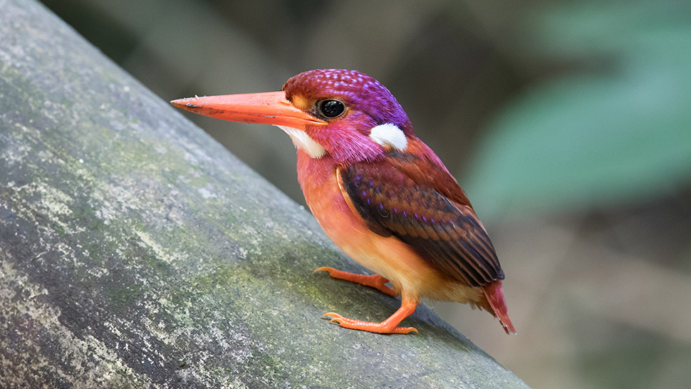
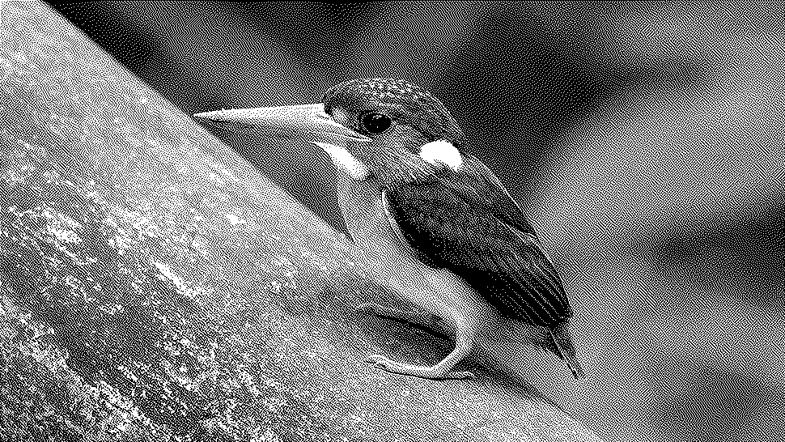

Node v22.

~~~
$ npm -g i atkinson
$ atkinson file.jpg > 1.png
~~~

`index.js` contains a function that takes an
[ImageData](https://developer.mozilla.org/en-US/docs/Web/API/ImageData)
object & modifies it in-place.

~~~
$ npm i atkinson
~~~

then

~~~
import {dithering} from 'atkinson'

let imagedata = ctx.getImageData(0, 0, img.width, img.height)
ctx.putImageData(dithering(imagedata), 0, 0)
~~~

## &#x2672; Loicense

MIT
